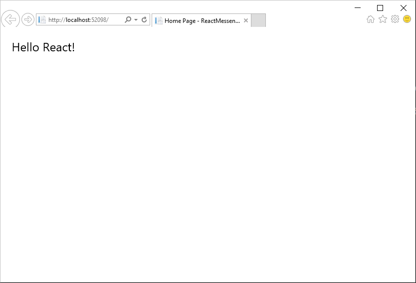
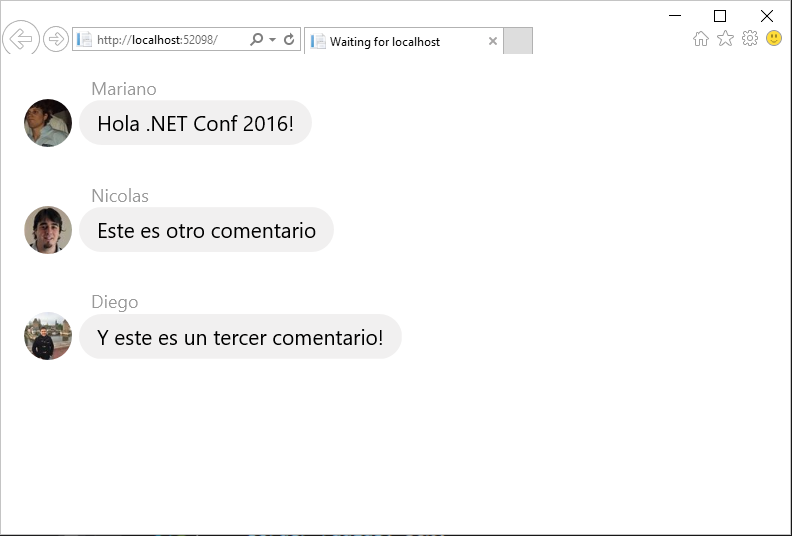

## Exercise 1: Hello React!

In this exercise, you start with a `Hello World` like applicationa and you end up with a fully functional React application with code separated into components and on-the-fly ES6 code compilation using Babel.

### Steps

1. Open the **ReactMessenger.sln** solution file under the **exercise-1\begin\ReactMessenger** folder.

1. Press F5 to build and run the solution. You should see something like this:

  

  Notice that this solution contains everything set up to start developing in React. In particular, notice that:

  1. The [React.AspNet](https://github.com/reactjs/React.NET) NuGet package is installed.
  1. React.JS libraries are being referenced in the **Layout.cshtml** file.
  1. The **HelloMessage.jsx** file is being referenced in the **Index.cshtml** file.
  1. The `<HelloMessage />` component is defined in this file and **ReactDOM** is used to render the component inside the `<div id="content"></div>` element.

1. Now we are going to create a simple Messenger app that will consist on the following component structure:

  ```
  - CommentBox
    - CommentList
      - Comment
  ```

  > **Note:** In React, everything is a component. And every component can have one or more components.

1. Let's start from the bottom: copy the content of the **exercise-1\assets\Comment.jsx** file inside the **ReactMessenger\wwwroot\js\app** folder. Take a moment to analyze the code. Notice the following:

  1. The code is using the [ES6](http://es6-features.org/) syntax and we can use it because of the React.NET on-the-fly ES6 compilation via [babel](https://babeljs.io/)
  2. The `render()` function is returning something similar to HTML markup. That's [JSX](https://facebook.github.io/react/docs/displaying-data.html) and is what React uses to define UIs, via JS code.
  3. The information is stored in the `this.props` property. We will see how this work in the next step.

1. Now, copy the content of the **exercise-1\assets\CommentList.jsx** file inside the **ReactMessenger\wwwroot\js\app** folder. Notice that this component has a similar structure, with the following differences:

  1. It dynamically generates several `<Comment/>` components based on the `this.props.data` array.
  1. Each component receives their properties like they were HTML attributes.
  1. Those components are rendered under the `<div className="commentList"></div>` element, by simply doing `{commentNodes}` under that element.

1. It's time to add the last component by copying the content of the **exercise-1\assets\CommentBox.jsx** file inside the **ReactMessenger\wwwroot\js\app** folder. Like before, this component is composed by another comment. 

  Take a minute to analyze the `ReactDOM.render()` function. Notice that the hardcoded comments are sent via props, like before. Nothing has changed compared to the `<HelloWorld/>` component, except that we use another component :)

1. Finally, add a reference to those 3 files by replacing the line 7 of the **Views/Home/Index.cshtml** file with the following (it should be placed below the `<div id="content">` element)

  ```
  <script src="@Url.Content("~/js/app/Comment.jsx")"></script>
  <script src="@Url.Content("~/js/app/CommentList.jsx")"></script>
  <script src="@Url.Content("~/js/app/CommentBox.jsx")"></script>
  ``` 

  You are all set! Now, you should see something like this:

  

### Next steps

You will notice that the app you've created has the following pending challenges:

* You cannot add new comments.
* The comments are hardcoded in the client.
* The JS and CSS files are defined one by one in the Index/Layout page.

In the next exercise, you will learn how to create a component to add new comments and also how to retrieve the data from the server.