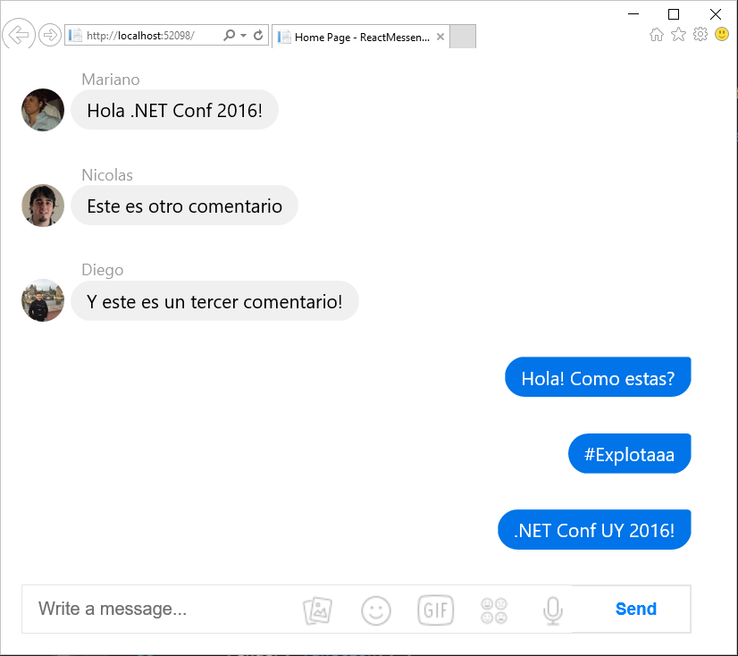

## Exercise 2: Server-side communication

In this exercise, you build the server-side code to manage the list of comments using the `IRepository` pattern. Then, you will update the client to perform polling operations to retrieve the data periodically. Finally, you will implement the logic to add new comments, using a new component in the Client and exposing a new endpoint in the backend.

### Steps

1. Continue using the same solution you completed in Exercise 1. Alternatively, you can open the **ReactMessenger.sln** solution file under the **exercise-1\end\ReactMessenger** folder.

  In case you've forgot, this is how the app should look like:

  

  Now we are going to implement the following improvements to this app:

  1. Retrieve the comments from the backend, instead of using a hardcoded data in the client.
  1. Implement the backend logic needed to store new comments.
  1. Add a new component to create new comments in the app.

  That said, let's get started.

#### Retrieve the comments from the backend

1. Create a new **Models** folder and then copy the **exercise-2\assets\Comment.cs** file inside the folder. This is a basic model for the comments, containing the author, the text and the image URL of the avatar.

1. Then, create a new **Repositories** folder and copy the **exercise-2\assets\IRepository.cs** and the **exercise-2\assets\CommentsRepository.cs** files inside the folder. Notice that these files follow the [Repository](http://www.asp.net/mvc/overview/older-versions/getting-started-with-ef-5-using-mvc-4/implementing-the-repository-and-unit-of-work-patterns-in-an-asp-net-mvc-application) pattern, and they can be potentially be used to retrieve the data from a database.

  > **Note:** also notice that for demo purposes we are hardcoding the data in the **CommentsRepository.cs** file.

1. Now, create a new **Web API Controller** class under the **Controllers** folder named **CommentsController**. You can achieve this by right-clicking this folder and then selecting Add | New File. 

1. Paste the following content inside that file.

  ```
  namespace ReactMessenger.Controllers
  {
      [ResponseCache(Location = ResponseCacheLocation.None, NoStore = true)]
      [Route("api/[controller]")]
      public class CommentsController : Controller
      {
          private static IRepository<Comment> commentsRepository = new CommentsRepository();

          // GET: api/comments
          [HttpGet]
          public IEnumerable<Comment> Get()
          {
              return commentsRepository.GetAll();
          }
      }
  }
  ```
  >**Note:** notice that we are also configuring the cache logic to *None*, this is to prevent the browser from caching this call. For more information about Response Caching, see [here](https://docs.asp.net/en/latest/performance/caching/response.html).

  You will also have to update the `using` statements to make the code build.

  ```
  using ReactMessenger.Repositories;
  using ReactMessenger.Models;
  ```

1. Finally, make sure that the model is going to be serialized properly by adding these lines in the **Startup.cs** file, just below the `services.AddReact()` line inside the `ConfigureServices` method.

  ```
  // This method gets called by the runtime. Use this method to add services to the container.
  public void ConfigureServices(IServiceCollection services)
  {
      // Add react services
      services.AddSingleton<IHttpContextAccessor, HttpContextAccessor>();
      services.AddReact();

      // Add framework services.
      services.AddMvc()
          .AddJsonOptions(options =>
          {
              options.SerializerSettings.ContractResolver = new CamelCasePropertyNamesContractResolver();
          });

      ...
  }
  ```

1. Now we are ready to update the client. Replace the content of the **ReactMessenger\wwwroot\js\app\CommentBox.jsx** file with the content of the **exercise-2\assets\CommentBox.jsx**, or simply delete and add the new file. Notice the changes in the file, in detail:

  1. The URL of the endpoint to retrieve the comments is defined in the `url` prop.
  1. The data is being requested every X seconds, defined in the `pollInterval` prop.
  1. The initial state of the data is an empty array.
  1. After the component is mounted, the polling logic starts.

1. Press F5 to run the solution. You should now see something like this:

  

  Nothing has really changed, but if you press F12 you will notice that the comments are being requested every X seconds.

#### Implement backend logic to store new comments

1. This section is really simple: you just need to add a new POST endpoint to receive new comments and add them to the `CommmentsRepository`, which will store the comment and retrieve it with the rest when requested. Add this method to the `CommentsController` class:

  ```
  // POST: api/comments
  [HttpPost]
  public Comment Post(Comment comment)
  {
      return commentsRepository.Insert(comment);
  }

  ```

  Now we are ready to create the component in the client-side.

#### Add a new component to create new comments

1. Copy the **exercise-2\assets\CommentForm.jsx** file inside the **ReactMessenger\wwwroot\js\app** folder. This is a component that will take care of gathering the information that will be sent to the backend. 

1. Now, we need to update the `<CommentBox/>` component to use the newly created component. Update the `render()` method with the following code:

  ```
  render: function() {
    return (
      <div className="commentBox">
        <CommentList data={this.state.data} />
        <CommentForm onCommentSubmit={this.handleCommentSubmit} />
      </div>
    );
  }
  ```

1. Let's implement the code that is in charge of sending the information to the backend. Add the following function inside the `<CommentBox/>` component, just above the `render()` function.

  ```
  handleCommentSubmit: function (comment) {
    const data = new FormData();
    data.append('text', comment.text);
    data.append('author', comment.author);

    const xhr = new XMLHttpRequest();
    xhr.open('post', this.props.url, true);
    xhr.onload = function () {
      this.loadCommentsFromServer();
    }.bind(this);

    xhr.send(data);
  },
  render: function() {
    ...
  }
  ```

1. Finally, don't forget to add the script tag to include the `<CommentForm/>` component code in the **Index.cshtml** file. 

  ```
  ...
  <script src="@Url.Content("~/js/app/CommentForm.jsx")"></script>
  <script src="@Url.Content("~/js/app/CommentBox.jsx")"></script>
  ```

And that's it. Take a couple of minutes to play with the app. You now have a fully functional React (demo) app. Enjoy!




### Next steps

You will notice that the app you've created has the following pending challenges:

* The comments are requested AFTER React is initialized, causing a significant delay (empty page).
* The JS and CSS files are defined one by one in the Index/Layout page.
* The data is not being saved in the client.

You can learn how to fix those items by looking at the **Optimization** examples.